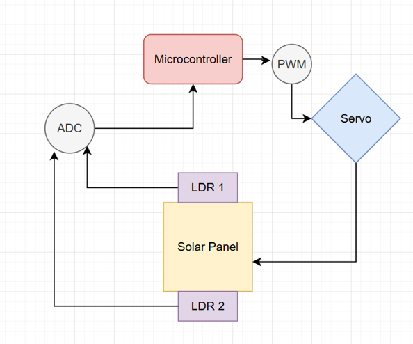
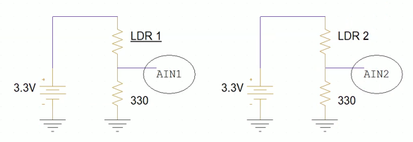
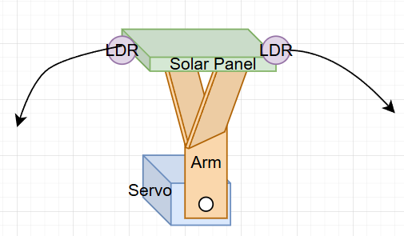

# ECE 425/L Final Project: Sun Tracking Solar Panel

## Introduction
This is the final project assignment for ECE 425/425L Summer 2025 at California State University, Northridge

Designed By:
- Sean Felker
- Prachi Patel

Professor:
- Shahnam Mirzaei

## Objective
The goal of this project is to design a servo-controlled arm holding a small solar panel that will automatically rotate the solar panel towards the side being exposed to more light. The system is controlled by a TM4C123GH6PM microcontroller. Light dependent resistors (LDR) will be used to read the light exposure for the two sides of the solar panel. The microcontroller will respond to these readings by rotating the servo so that the solar panel is exposed to the most amount of light possible. Code is written and flashed to the microcontroller using the Keil µVision IDE.

## Concepts and Skills Used
- **Programming Language:** C
- **Embedded Systems:** Register-level programming, peripheral configuration, real-time control
- **Peripherals:** General purpose input output (GPIO), Analog-to-digital converter (ADC), Pulse width modulation (PWM), interrupts, NVIC configuration
- **Control:** Sensor-based servo control
- **Hardware:** Voltage-divider circuits, analog signal measurement

## Components
- TM4C123GH6PM microcontroller
- EduBase-V2 base board
- SG90 servo motor kit
- 60mm x 50mm 5V solar panel
- Two 330Ω resistors
- Two 2-5kΩ light dependent resistors
- USB-A to Micro-USB Cable
- 3.3V power supply
- Cardboard, tape, glue, screwdriver, soldering kit
- Keil µVision IDE

## Video Demo
[Video Link](https://youtube.com/shorts/Q4wnRayLDo0?feature=share)

## Methodology

### ADC and Light Dependent Resistors (LDR)
- The core function of a light dependent resistor is that it has an inverse relationship between the amount of light it is exposed to and the resistance it provides (more light = less resistance).
- GPIO ports PE1 and PE2 are configured into their analog channel modes to read voltage.
- ADC module 0 sample sequencer 0 takes 1 sample from each channel every 100 milliseconds.
- The digital voltage value read by the ADC is converted to its analog value using the equation V_analog = V_digital * V_ref / (2^N - 1), where V_ref = 3.3V and N = 12 bits for our ADC.
- 330Ω resistor in series is used to divide the voltage going across the LDR
- More light -> less LDR resistance -> more voltage being read by the ADC input channels

  

### Servo Control: PWM 
- A 3.125 MHz clock is used for the PWM module. To get a 50 Hz PWM signal required by the servo, a load count value of 3.125 MHz / 50 Hz = 62500 is used. The duty cycle of the signal controls the position of the servo.
- The PWM counts is a down counter from 62500 to 0 wrapping around. The output signal is high when the counter reaches the load value (62500), and low when the counter reaches the compare value. Adjusting the compare value allows the duty cycle to be controlled through the equation: duty cycle = (1 - (compare_value/load_value)) * 100%.
- We tested and found that for a 180° rotation, the compare value ranges between 54600 and 61000 (7.5 to 12.5% duty cycle). Software functions were written to rotate the servo left and right by about 1° by increasing or decreasing the compare value by 35.

### Summary of How it Works
1. ADC obtains 2 digital values from sampling each LDR circuit, microprocessor software converts these to analog readings
2. The difference between these readings is calculated. If the difference is greater than 0.15V, the microprocessor checks which reading is larger. If the difference is not more than 0.15V, the servo is not rotated.
3. Either the servoLeft(void) or servoRight(void) function is called to rotate the solar panel about 1° towards the LDR being exposed to more light
4. Wait 100ms and repeat

